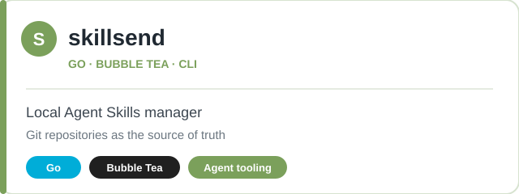
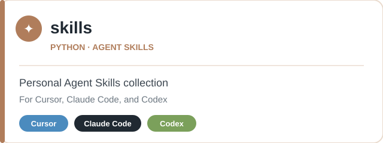

  <b>Hi 👋, I'm 抹茶波波冰</b> 
  <i>A passionate developer from China</i>

  
  
  
  

---

<table>
<tr>
<td width="55%">

### 🧋 关于我

- 🔭 作品：**[skillsend](https://github.com/BubbleBubbleIce/skillsend)**（Go · Bubble Tea TUI，Agent 技能管理面板）· **[skills](https://github.com/BubbleBubbleIce/skills)**（Agent 技能集）
- 🌱 学习中：**Rust · Go**
- 👯 想找：**开源协作伙伴**
- 💬 可聊：**React / Node.js / TypeScript**

</td>
<td width="45%" align="center">

### 🛠 手边工具

  
  
  
  
  
  
  

*正在学的，也泡在杯里了*

</td>
</tr>
</table>

---

### 📦 作品

  
  

  
  
  
  

---

### 📊 统计 & 徽章

  
  

  

  

---

  <b>Crafted with 🍵 &amp; ❤️ — one shot, one README.</b>

