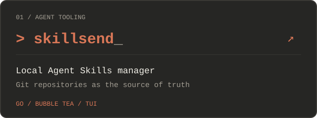
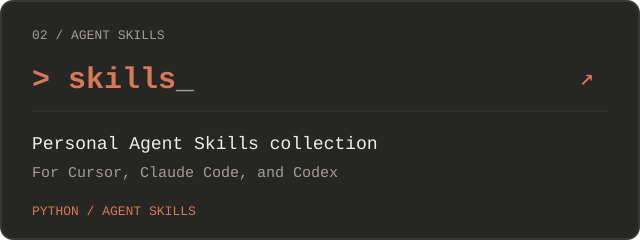

<p align="center">
  
</p>

<p align="center">
  
  
  
</p>

### `01` / about

来自中国的开发者，正在做 Agent 工具，也在学习 **Go / Rust**。

```text
$ whoami
name       抹茶波波冰 / BubbleBubbleIce
education  Remote Sensing Science and Technology
talk       React · Node.js · TypeScript · PyTorch · LLM
fuel       matcha + boba
```

### `02` / selected work

<p align="center">
  <a href="https://github.com/BubbleBubbleIce/skillsend">
    
  </a>
  <a href="https://github.com/BubbleBubbleIce/skills">
    
  </a>
</p>

| project | what it does |
| :-- | :-- |
| [skillsend](https://github.com/BubbleBubbleIce/skillsend) | Go · Bubble Tea TUI，终端里的 Agent 技能管理面板 |
| [skills](https://github.com/BubbleBubbleIce/skills) | Agent 技能集，面向 Cursor / Claude Code / Codex |

**手边工具** · JavaScript / TypeScript / React / Node.js / Python / Go / Docker

### `03` / activity

<p align="center">
  
  
</p>

<details>
  <summary>更多统计 / streak &amp; trophies</summary>
  <br>
  <p align="center">
    
  </p>
  <p align="center">
    
  </p>
</details>

---

<p align="center"><samp>Made with matcha. Built in the terminal.</samp></p>
